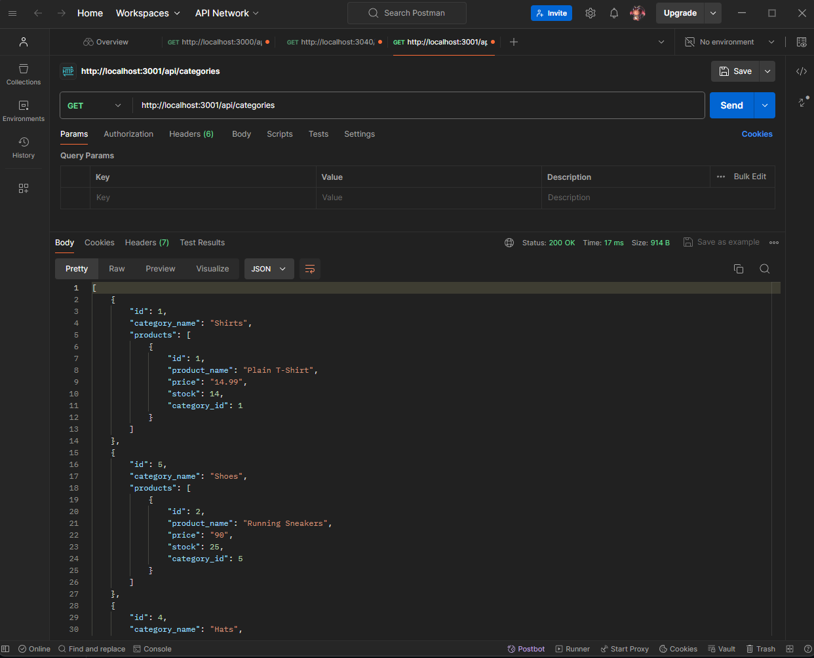

# 13 ORM: E-Commerce Back End

## The Challenge:

Internet retail, also known as **e-commerce**, plays a significant role within the electronics industry, as it empowers businesses and consumers alike to conveniently engage in online buying and selling of electronic products. E-commerce platforms like Shopify and WooCommerce provide a suite of services to businesses of all sizes. Due to the prevalence of these platforms, developers should understand the fundamental architecture of e-commerce sites.

Your task is to build the back end for an e-commerce site by modifying starter code. You’ll configure a working Express.js API to use Sequelize to interact with a PostgreSQL database.

## Project Conduction:

As a manager at an internet retail company, I want a back end for my e-commerce website that uses the latest technologies, that way my company can compete with other e-commerce companies.

## Acceptance Criteria:

- With a functional Express.js API, when the user adds my database name, PostgreSQL username, and PostgreSQL password to an environment variable file, they are able to connect to a database using Sequelize.

- When the user enters schema and seed commands, a development database is then created and is seeded with test data.

- When the user enters the command to invoke the application, the server will start and the Sequelize models are synced to the PostgreSQL database.

- When the user opens API GET routes in Postman for categories, products, or tags, the data for each of these routes is then displayed in a formatted JSON.

- When the user tests API POST, PUT, and DELETE routes in Postman, they are able to successfully create, update, and delete data in my database.

- Syncs Sequelize models to a PostgreSQL database on the server start.

- Includes column definitions for all four models outlined.

## Technology Stacks:
- PostgreSQL
- Postman

## npm Packages:
- Inquirer
- pg
- dotenv

## Mock-Up:

The following screenshot shows the application's GET routes to return all categories being tested in Postman:

The following screenshot shows the application's GET routes to return a single category being tested in Postman:

The following screenshots shows the application's POST, PUT, and DELETE routes for categories being tested in Postman:

## The Deployment:

The Repository: [Click Here.](https://github.com/NovaLanceBrittany/HW-12-SQL-Employee-Tracker)

The Google Drive: [Click Here.](https://drive.google.com/drive/folders/1-Uq_IwsUBUY685qEZc_o2CkMHt5QHZOC?usp=sharing)

